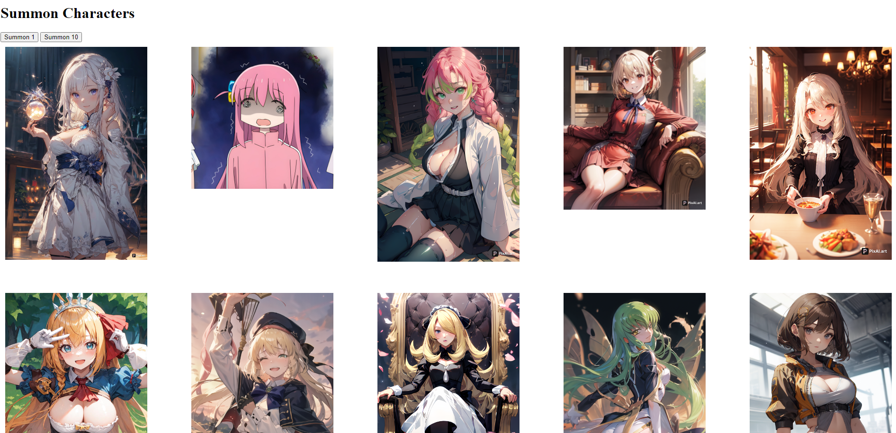

# Stress Free Gacha [Work in progress]

    
## 📄 Description 
Gacha simulator that won't kill your wallet, using PixelAI users can randomly generate AI images 
of popular anime/video game characters.

## 🪛 Technologies used 

<a href="https://nodejs.org/">Node.js</a>

<a href="https://www.npmjs.com/">NPM</a>

<a href="https://www.npmjs.com/package/express">Express.js</a>

<a href="https://www.npmjs.com/package/mysql2">MySQL2</a>

<a href="https://www.npmjs.com/package/sequelize">Sequelize</a>

  
## 📓 Table of Contents
- [Installation](#%EF%B8%8FInstallation)
- [Usage](#Usage)
- [Screenshot](#%EF%B8%8FScreenshot)
- [Video](#Video)
- [License](#%EF%B8%8FLicense)
- [Contributing](#Contributing)
- [Tests](#%EF%B8%8FTests)
- [Questions](#Questions)
    
## 🖥️ Installation 
 N/A
  
## 💬 Usage 
Use for fun!

## 🖼️ Screenshot

## 📹 Video

  
## ⚖️ License 
This project is licensed under MIT
  
## 🤝 Contributing 
N/A
  
## 🛠️ Tests
N/A
 
## ❔ Questions
If you have any questions about this project, please contact me directly at brian.trang9@gmail.com. Feel free to view more of my projects at https://github.com/MakeRedundant.